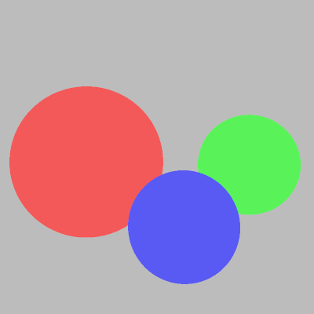
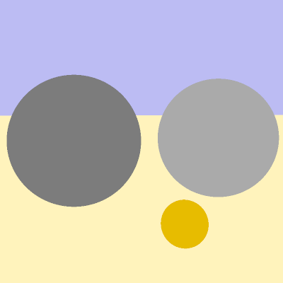
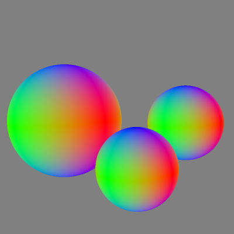
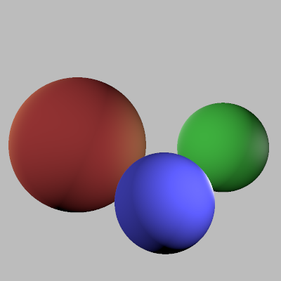

# Recursive ray tracing. 

## 1. Rayons primaires.

### 1.1 Génération des rayons. 

- Code du rendu (lancer de rayons) : 

```cpp
  Vector2i size = camera->outputSize();
  Ray ray = Ray();

  for (int y = -size.y(); y < size.y(); y++) {
    for (int x = -size.x(); x < size.x(); x++) {
      Point2f sample = Point2f(x/(float)size.x(), y/(float)size.y());
      camera->sampleRay(ray, sample);
      Color3f color = integrator->Li(scene, ray);
      result->put(Point2f((x + size.x()) / 2, (y + size.y()) / 2), color);
    }
  }
```

- Rayons (en fonction du pixel à remplir) : 

```cpp
    ray.origin = m_center;
    ray.direction = m_camF + m_camX * samplePosition.x() - m_camY * samplePosition.y();
    ray.direction.normalize();
```

- Éventuelle intersection du rayon avec les objets : 

```cpp
  for (size_t i = 0; i < m_shapeList.size(); ++i) {
    Hit tempHit;
    m_shapeList[i]->intersect(ray, tempHit);
    if(tempHit.t < hit.t){
      hit = tempHit;
    }
  }
```
<div style="page-break-after: always;"></div>

### 1.2. Sphères. 

- Calcul des intersection avec les sphères : 

```cpp
  Vector3f xp = ray.origin - m_center;
  float dn = ray.direction.norm();
  float dot = xp.dot(ray.direction);
  float xpn = xp.norm();

  float a = dn * dn;
  float b = 2 * dot;
  float c = xpn * xpn - m_radius * m_radius;

  float delta = b*b - 4 * a * c;
```
<div style="page-break-after: always;"></div>

### 1.3. Première image. 

- Intégrateur flat : 

```cpp
    Hit hit = Hit();
    scene->intersect(ray, hit);
    if(hit.foundIntersection()){
      return hit.shape->bsdf()->albedo(); 
    }else{
      return scene->backgroundColor(ray.direction);
    }
```
**Image obtenue :**

<p align="center">
    
</p>

<div style="page-break-after: always;"></div>

### 1.4. Plans. 

- Calcul des intersections avec les plans : 

```cpp
  Point3f a = m_position;
  Vector3f d = ray.direction;
  Vector3f n = m_normal;
  Point3f o = ray.origin;

  if (d.dot(n) == 0) 
    return;

  float t = (a.dot(n) - o.dot(n)) / (d.dot(n));
  if (t > 0) {
    hit.t = t;
    hit.shape = this;
    hit.normal = m_normal;
    }
```

**Image obtenue :**

<p align="center">
    
</p>

<div style="page-break-after: always;"></div>

## 2. Éclairage local. 

### 2.1. Normales 

- Intégrateur normals : 

```cpp
    Hit hit = Hit();
    scene->intersect(ray, hit);
    if(hit.foundIntersection()){
      return Color3f(hit.normal.cwiseAbs().x(), hit.normal.cwiseAbs().y(), hit.normal.cwiseAbs().z());
    }else{ 
      return scene->backgroundColor(ray.direction);
    }
```

**Image obtenue :**

<p align="center">
    
</p>

<div style="page-break-after: always;"></div>

### 2.2. Calcul de l'éclairage. 

- Intégrateur lumière directe : 

```cpp
      Normal3f n = hit.normal;
      Vector3f p = ray.at(hit.t);
      Color3f color = Color3f(0,0,0);
      
      for(size_t i = 0; i < scene->lightList().size(); i++){
        Vector3f lightdir;
        float dist;
        Color3f intensity = scene->lightList()[i]->intensity(p, lightdir, dist);
        Color3f phong = hit.shape->bsdf()->eval(lightdir, ray.direction, n); 
        color += std::max(lightdir.dot(n), 0.f) * intensity * phong;
      }
      return color;
```

**Image obtenue :**

<p align="center">
    
</p>

Commandes utiles : 

```./mds3d_raytracer ../mds3d-raytracer/scenes/troisSpheres.scn```
```./mds3d_raytracer <scene.scn> [--no-gui]```
